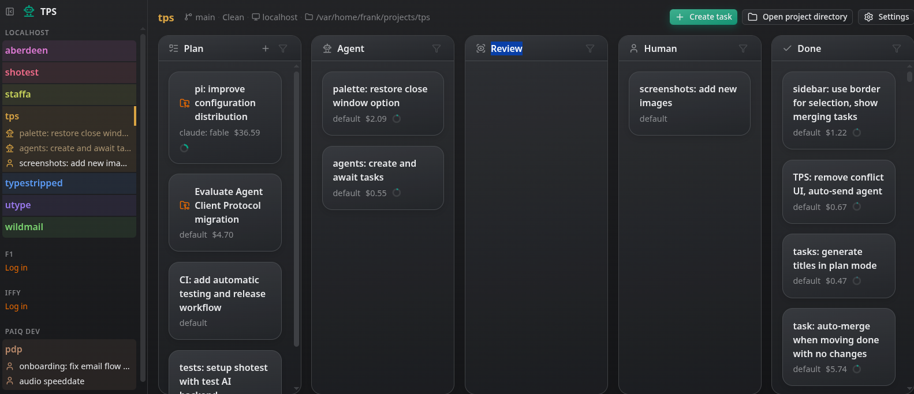
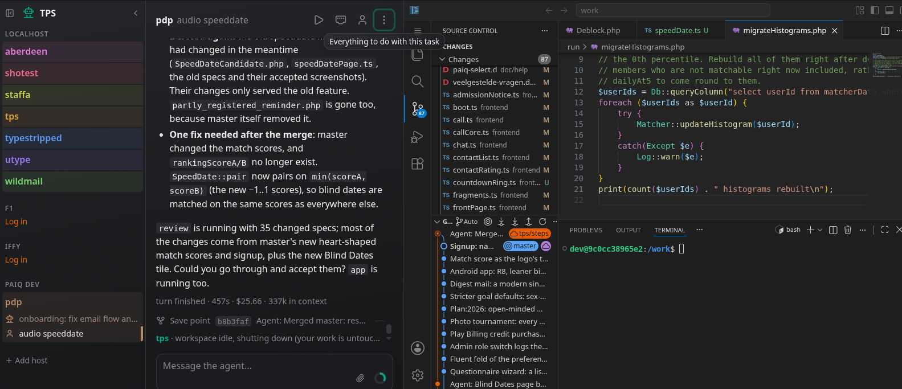
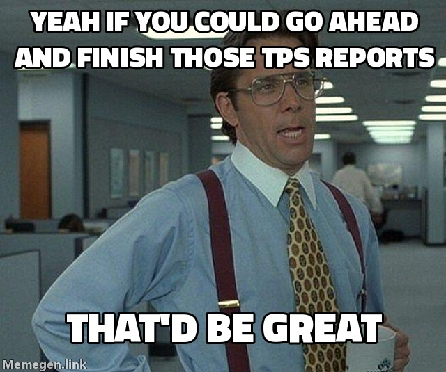

# TPS

TPS is your all-in-one dashboard for working on many tasks across many
projects at once. For each task you get an agent chat and a VS Code instance
side-by-side, backed by its own lightweight sandbox container and repository.
Claude Code only, for now.

<p>
<a href="doc/tps1.png"></a>
<a href="doc/tps2.png"></a>
</p>

## What makes it good

**A sandbox per task.** A hardlinked clone (so it costs next to nothing) in a
rootless podman container of its own. Agents cannot touch your checkout or
each other, you run as many as your budget allows, and a task that went wrong
is deleted rather than cleaned up after.

**Many projects, one place.** The sidebar lists every project with the tasks
that need you, the ones an agent is on and the ones you have VS Code open on,
across all your machines. Switch between them with a click or a few letters
in the ctrl-L palette; each VS Code stays where you left it.

**A Kanban board per project.** See the tasks you're planning, what agents
are working on, what requires your attention, and what has been completed at
a glance.

**Any number of machines.** Add a host by whatever you would type after `ssh`,
and TPS installs its daemon there and shows its projects beside your local
ones, VS Code and forwarded ports included. The heavy lifting happens on the
big desktop while you steer from the laptop.

**Merges that land themselves.** A task becomes one commit on the default
branch, with a merge message proposed by the agent. If the branch moved on, the work
is put on top of it first, as a patch, and a conflict is handed to the task's agent
to resolve. Tasks can also be configured to auto-merge when the agent is done.

**An environment you define and the agent extends.** A `Containerfile.dev` in
your repository is the image tasks run in, with nothing TPS-specific in it.
When the agent lacks a tool, it adds it there, continues in the rebuilt
container, and the change lands with the rest of its work.

**Containers within.** TPS provides a Docker-compatible socket for working
with (recursively) nested containers without escaping the sandbox. So for instance
tests requiring `docker` or `docker compose` mostly just work.

**VS Code on every task.** In the browser, running in the task's container on
the task's files, with a terminal. Read what the agent did, fix a thing
yourself, run the tests.

**Services and ports.** The dev server, the test suite, and whatever else the
agent starts run as named services with their output kept, behind a play
button. The ports the image exposes are forwarded to your browser, so one click
opens the app the agent is working on.

**Follow-ups remember.** A merged task keeps its conversation: send it a
message later and the agent continues in a new clone, knowing what it did the
first time.

**Finished tasks weigh little.** A task that is done keeps its conversation
compressed, and one closed without merging keeps its work as a patch rather
than a checkout; picking it up again puts the work onto the branch as it is
then, conflicts marked in the files.

**It keeps going.** The remote daemons continue work while your laptop sleeps.
It will drive agents forward, do auto-merges, initiate tasks queued with
dependencies, auto-resuming after hitting a 5H session limit, and keep a 
wake-lock on the system while doing so.

**Clean linear history.** Your repository only ever receives the squashed
commits, each on top of the branch as it stands.

And of course TPS also handles the usual: an agent chat that allow mid-run steering
and pasting screenshots and other files, a choice of model per task, cost tracking with a
budget that parks a task when it is reached, opt-in desktop notifications when a task needs you, and keyboard shortcuts for the things you do all day.

## Installing

TPS runs on Linux, any distribution. Every machine that runs projects needs:

- **podman**, 4 or later, set up rootless (the distro package normally does
  that), and **git**;
- a **Claude login**: the `~/.claude/.credentials.json` that the claude CLI
  writes when you log in with it, or `ANTHROPIC_API_KEY` in the environment.
  TPS downloads claude itself, so the CLI is only needed for that one login on
  your own machine; a host over SSH gets your login copied from its menu.

A host over SSH works best with lingering on for your user (`loginctl
enable-linger`): its daemon and containers then carry on while your laptop
sleeps and the connection is gone. TPS points it out when it is off.

Download a release into a bin directory of your own and start it:

```sh
mkdir -p ~/.local/bin
curl -fsSL -o ~/.local/bin/tps https://github.com/vanviegen/tps/releases/latest/download/tps-linux-$(uname -m)
chmod +x ~/.local/bin/tps
~/.local/bin/tps --autostart
```

`--autostart` writes a desktop autostart entry, so TPS starts at every login
without opening a browser, and then runs like plain `tps` does: the dashboard
opens at <http://localhost:4820/>. Most distributions put `~/.local/bin` on
your `PATH` already. Updating is the same `curl`.

### Use it as an app

The recommended way to use TPS is to install the dashboard as an app: in
Chrome, Edge, Brave or another Chromium browser, click *Install* in the address
bar. TPS gets a window and an icon of its own, and F11 makes it fullscreen and
capture all VS Code keys (like ctrl-w).
With the chat, VS Code, the terminal and the running app all in there, you will
hardly need to leave it during your day.

## Building from source

With Go 1.27 and Node:

```sh
npm install && npm run build       # bundles the web UI into web/dist
CGO_ENABLED=0 go build -o tps .    # embeds it into one static binary
```

Or, without installing either, in the project's own dev image:

```sh
podman build -t tps-dev -f Containerfile.dev . && podman run --rm --userns=keep-id:uid=1000,gid=1000 -v "$PWD:/work:z" tps-dev sh -c 'npm install && npm run build && CGO_ENABLED=0 go build -o tps .'
```

`./dev.sh` rebuilds and restarts on every change, and `go test ./...` runs the
tests. Pushing a `v*` tag has GitHub Actions build the release binaries.

`demo/seed.sh` fills a home directory with two small projects and a board's
worth of tasks around them, to have something to click through: a merged task
whose commit is in the log, one waiting to be merged with its work in a
workspace, a plan waiting on another plan, a parked one and a closed one. The
project's own dev container runs it before starting TPS, so the task's play
button gives a dashboard with a board on it; `TPS_DEMO_HOME` points it at a
directory of its own.


