# TPS

TPS is your all-in-one dashboard for having Claude Code or pi (experimental) work on many tasks across many
projects at once. For each task you get an agent chat and a VS Code instance
side-by-side, backed by its own lightweight sandbox container and repository.

<p>
<a href="doc/tps1.png"></a>
<a href="doc/tps2.png"></a>
</p>

## What makes it good

<table>
<tr><td>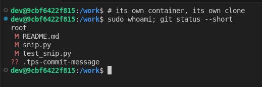</td><td>

**A sandbox per task.** A hardlinked clone of your repository in a rootless
podman container of its own. Agents cannot touch your checkout or each other,
and a task that went wrong is deleted rather than cleaned up after.

</td></tr>
<tr><td>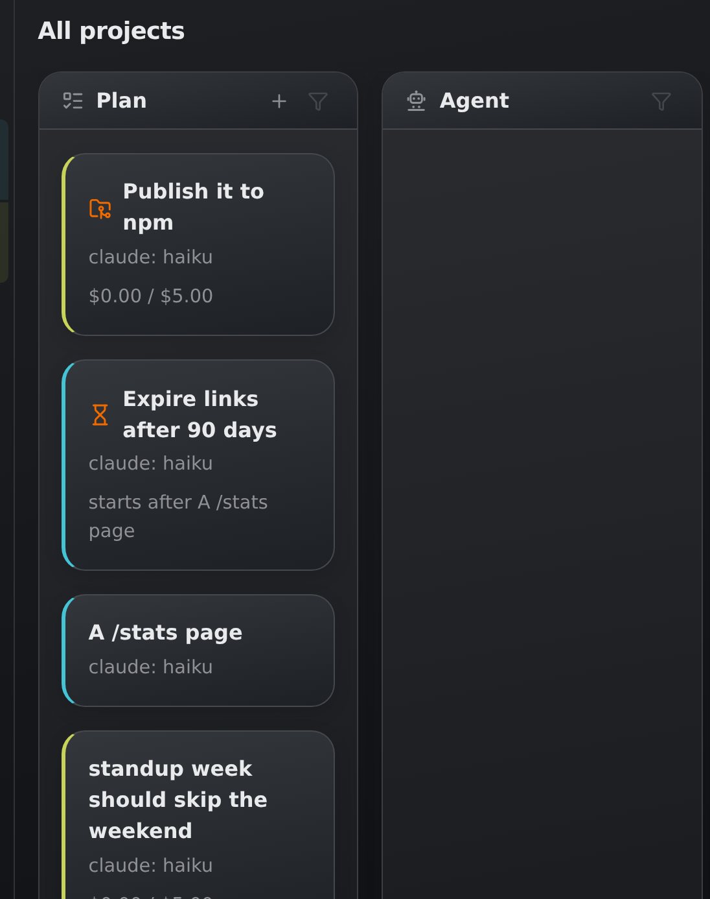</td><td>

**A Kanban board per project, and one for all of them.** The tasks you're
planning, what agents are working on, what needs your attention and what is
done, at a glance.

</td></tr>
<tr><td>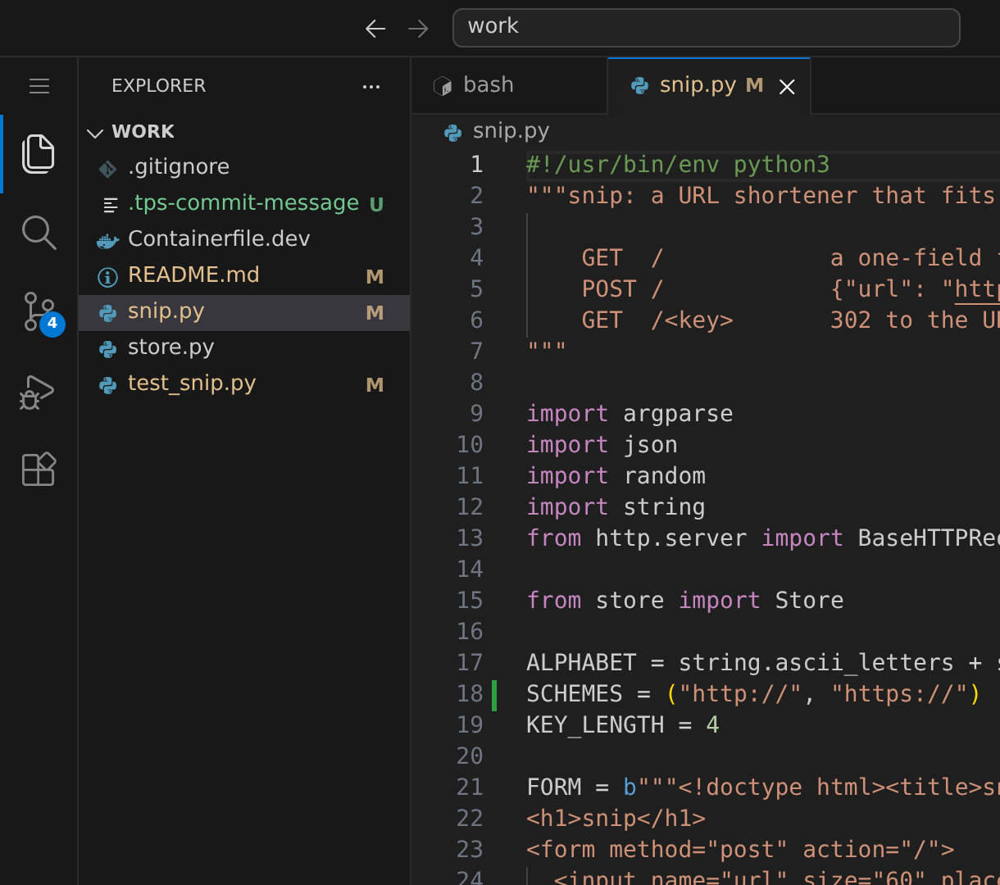</td><td>

**VS Code on every task.** In the browser, running in the task's container on
the task's files, with a terminal. Read what the agent did, fix a thing
yourself, run the tests.

</td></tr>
<tr><td>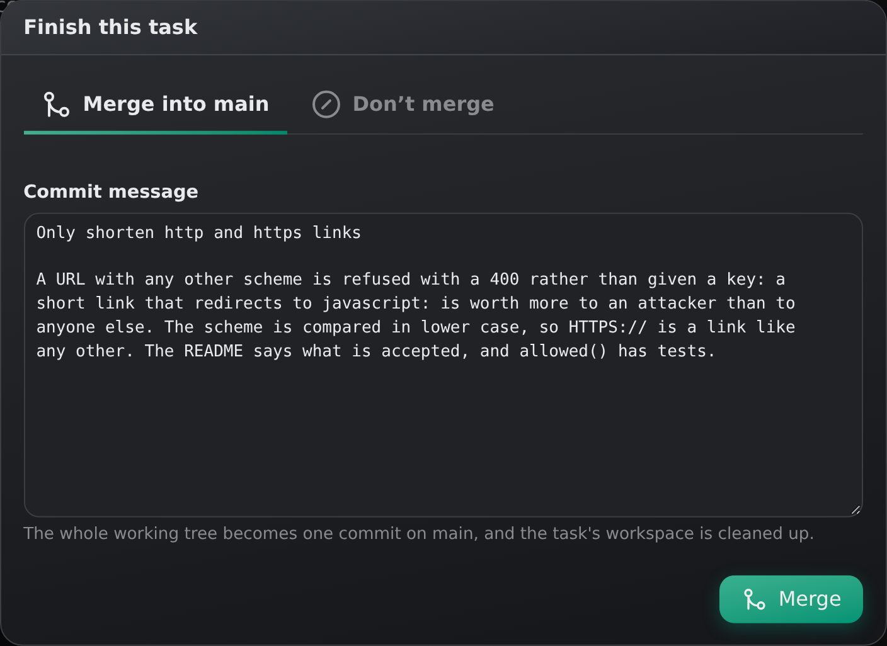</td><td>

**Merges that land themselves.** A task becomes one squashed commit on top of
the default branch, authored by you, with a message proposed by the agent. If
the branch moved on, it is merged into the work first, and a conflict is
handed to the task's agent to resolve. Tasks can also be set to merge as soon
as the agent is done.

</td></tr>
<tr><td>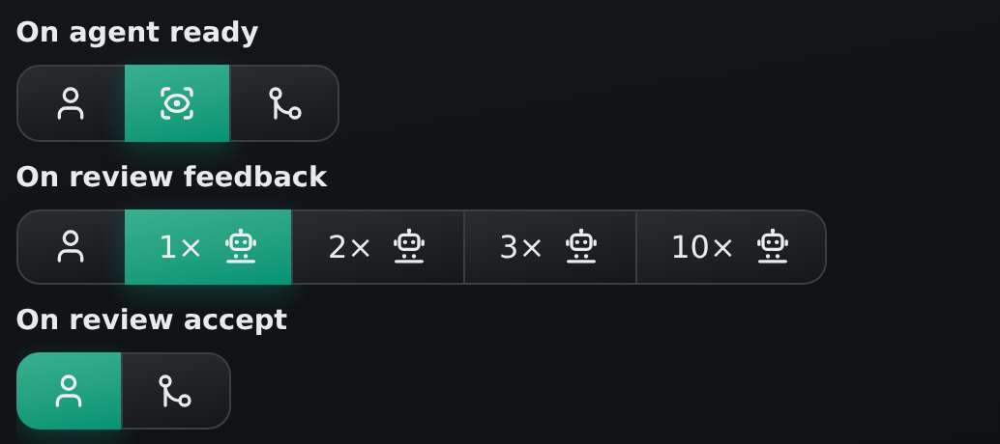</td><td>

**A second pair of eyes.** Work the agent reports ready can be read over by a
reviewing agent first: against what you actually asked for and code quality. It
fixes the small and obvious itself, and otherwise lists what to change. The
review can either be fed back to the implementing agent automatically, or left
as review notes for you.

</td></tr>
<tr><td>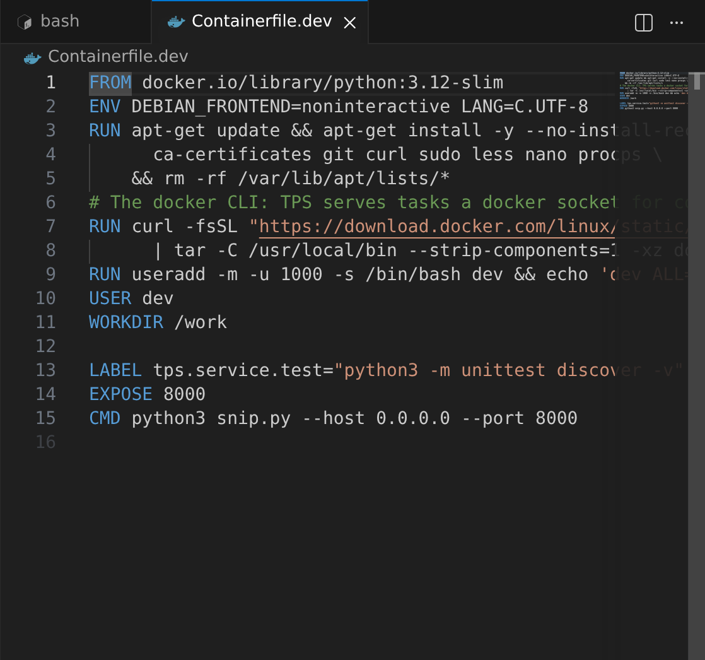</td><td>

**A project-specific environment.** A `Containerfile.dev` in
your repository is the image tasks run in, with nothing TPS-specific in it.
When the agent lacks a tool, it adds it there, continues in the rebuilt
container, and the change lands with the rest of its work.

</td></tr>
<tr><td></td><td>

**Containers within.** A Docker-compatible socket inside the sandbox, so tests
that need `docker` or `docker compose` (mostly) just work.

</td></tr>
<tr><td>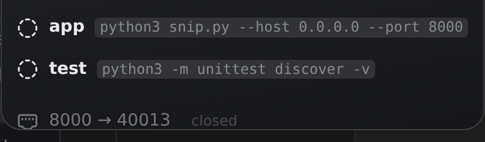</td><td>

**Services and ports.** The dev server, the test suite, and whatever else the
agent starts run as named services with their output kept, behind a play
button. The ports the image exposes are forwarded to your browser, so one click
opens the app the agent is working on.

</td></tr>
<tr><td>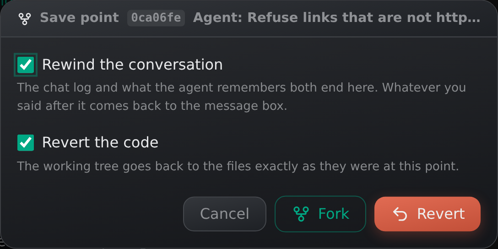</td><td>

**Revert and fork conversations.** Every Kanban state transition creates a
savepoint. You can reset a task or create a duplicate task at such savepoints,
specifying if you'd like to reset the conversation, the code, or both.

</td></tr>
<tr><td>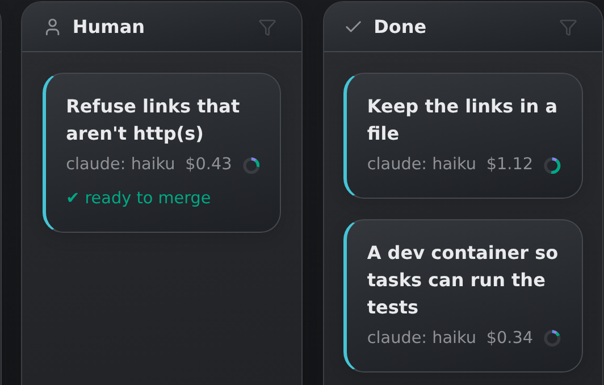</td><td>

**Follow-ups.** A done task is stored compactly, its workspace gone but its
conversation kept: send it a message later and the agent picks it back up on
top of the current code, knowing what it did the first time.

</td></tr>
<tr><td>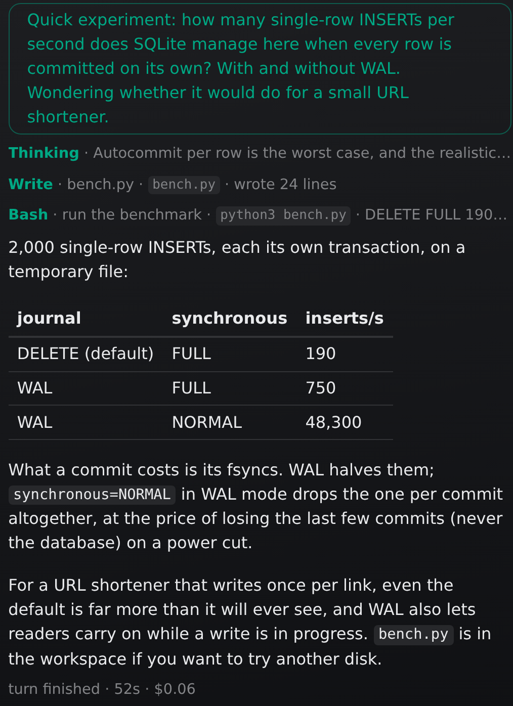</td><td>

**Scratch tasks.** For a question, some research or an experiment that belongs
to no project: scratch tasks are listed under their host, and start in an
empty repository of their own. One that grows into something can be turned into a
project, its work and conversation coming along.

</td></tr>
<tr><td>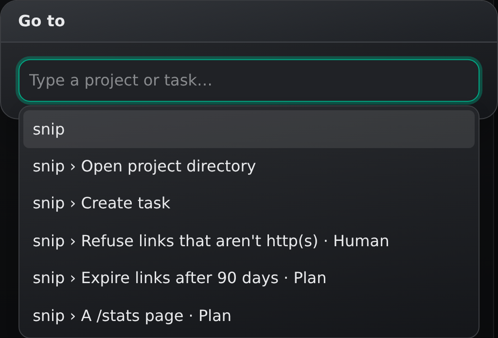</td><td>

**Many projects, one place.** The sidebar lists your projects and their active
tasks at a glance. Switch between them with a click or a few letters in the
ctrl-L palette; each VS Code stays where you left it.

</td></tr>
<tr><td>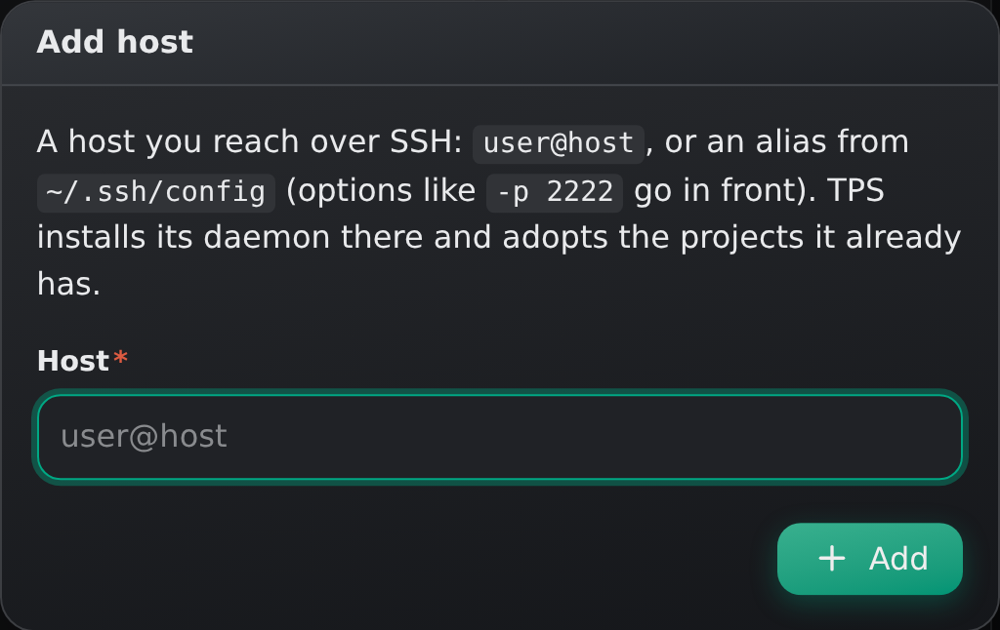</td><td>

**Any number of machines.** Add a host by whatever you would type after `ssh`:
TPS installs its daemon there, and its projects show up in the sidebar, VS Code
and ports included. The daemon keeps driving agents, merging and starting
queued tasks while your laptop sleeps.

</td></tr>
<tr><td>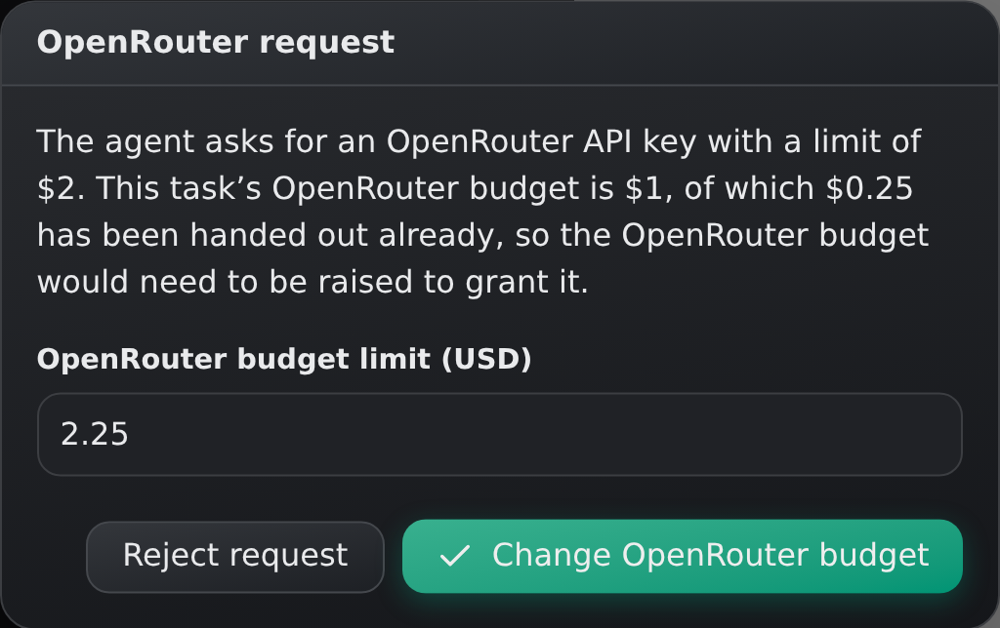</td><td>

**Image/audio/video model usage.** Agents can ask for an OpenRouter key, within
a budget you set per task, for image, audio and video work or for testing apps
that call a model API.

</td></tr>
</table>

And of course TPS offers: mid-run steering, pasting screenshots and other files, a choice
of model per task, cost tracking with a budget that parks a task when it is
reached, context-window insight, manual compaction, opt-in desktop notifications, and keyboard shortcuts for the things you do all day.

## Installing

TPS runs on Linux, any distribution. Every machine that runs projects needs:

- **podman**, 4 or later, set up rootless (the distro package normally does
  that), and **git**;
- a **login for the agent you run**: for Claude Code, a host without one says
  so under its name in the sidebar, and its page signs you in through your
  browser, here, and hands the login to that host. Every host gets one of its
  own this way, over SSH as much as here, and keeps it in
  `~/.local/share/tps/claude`, shared by all of its tasks; `ANTHROPIC_API_KEY`
  in the environment does instead. For pi, it is the `~/.pi/agent` you log in
  with on that host, mounted into every task of its own. No CLI is needed
  anywhere: TPS brings both.

A host over SSH works best with lingering on for your user (`loginctl
enable-linger`): its daemon and containers then carry on with the work they
have while your laptop sleeps and the connection is gone. TPS points it out
when it is off.

Download a release into a bin directory of your own and start it:

```sh
mkdir -p ~/.local/bin
curl -fsSL -o ~/.local/bin/tps https://github.com/vanviegen/tps/releases/latest/download/tps-linux-$(uname -m)
chmod +x ~/.local/bin/tps
~/.local/bin/tps --autostart
```

`--autostart` writes a desktop autostart entry, so TPS starts at every login
without opening a browser, and then runs like plain `tps` does: the dashboard
opens at <http://localhost:4820/>. Most distributions put `~/.local/bin` on
your `PATH` already. Updating is the same `curl`.

### Use it as an app

The recommended way to use TPS is to install the dashboard as an app: in
Chrome, Edge, Brave or another Chromium browser, click *Install* in the address
bar. TPS gets a window and an icon of its own, and F11 makes it fullscreen and
capture all VS Code keys (like ctrl-w).
With the chat, VS Code, the terminal and the running app all in there, you will
hardly need to leave it during your day.

## Building from source

With Go 1.27 and Node:

```sh
npm install && npm run build       # bundles the web UI into web/dist
CGO_ENABLED=0 go build -o tps .    # embeds it into one static binary
```

Or, without installing either, in the project's own dev image:

```sh
podman build -t tps-dev -f Containerfile.dev . && podman run --rm --userns=keep-id:uid=1000,gid=1000 -v "$PWD:/work:z" tps-dev sh -c 'npm install && npm run build && CGO_ENABLED=0 go build -o tps .'
```

`./dev.sh` rebuilds and restarts on every change, and `go test ./...` runs the
tests. Pushing a `v*` tag has GitHub Actions build the release binaries.

`demo/seed.sh` fills a home directory with two small projects and a board's
worth of tasks around them, to have something to click through: a merged task
whose commit is in the log, one waiting to be merged with its work in a
workspace, a plan waiting on another plan, a parked one, a closed one, one
asking for OpenRouter budget, and a scratch task. The
project's own dev container runs it before starting TPS, so the task's play
button gives a dashboard with a board on it; `TPS_DEMO_HOME` points it at a
directory of its own. On a freshly seeded demo, `node doc/screenshots.mjs`
retakes the screenshots of the features above.


